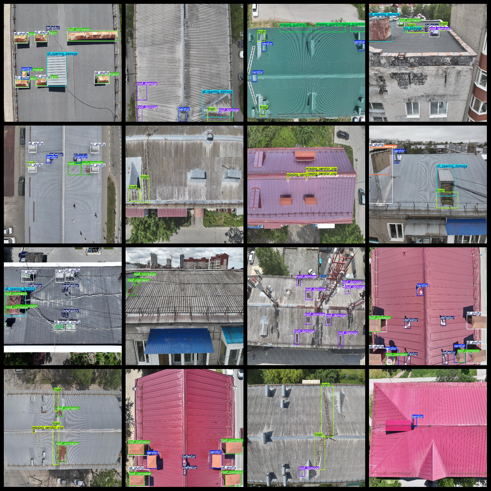
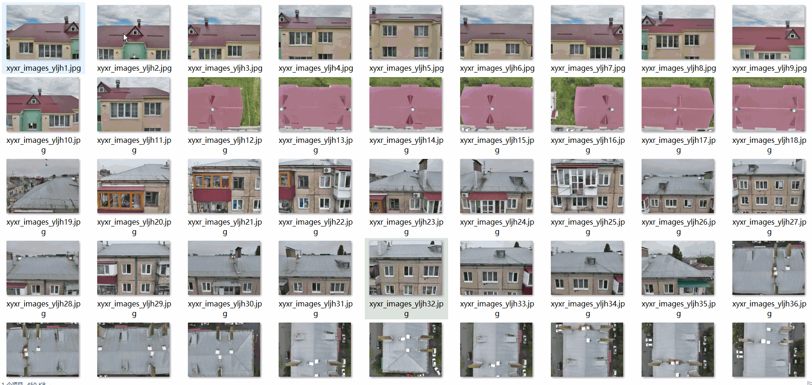

# Aerial Roofing Defect Dataset: 3354 Images in Pascal VOC+YOLO format

The aerial rooftop defect dataset consists of 3354 images in the Pascal VOC+YOLO format. The dataset does not include split paths in the txt file but only contains the jpg images along with corresponding VOC format xml files and yolo format txt files.

Number of Images (in jpg format): 3354

Number of Annotated Images (in xml format): 3354

Number of Annotated Images (in txt format): 3354

Number of Annotated Categories: 20

GitHub repository where the dataset is stored: datasets_sl

List of annotators for each category (the list from labels folder's classes.txt should be considered, not the order of yolo format categories): ["aerator", "all_opening_damage", "all_shafts", "bio_damage", "deflektor", "eaves_damage", "gutter_debris", "missing_aerator_cap", "missing_guardrail", "missing_ridge", "missing_vent_cap", "open_hatch", "ridge_damage", "roof_corrosion", "roof_crack", "roof_damage", "roof_opening_damage", "roof_swelling", "roof_vent_damage", "trash"]

Label Chinese Translation:

- Windshield vent damage
- Missing aerator cap
- Missing guardrail
- Missing ridge
- Missing vent cap
- Open hatch
- Ridge damage
- Roof corrosion
- Roof crack
- Roof damage
- Roof opening damage
- Roof swelling
- Roof vent damage
- Trash

Each category has been annotated with boxes:

- Aerator box count = 3775
- All opening damage box count = 2402
- All shafts box count = 7335
- Bio damage box count = 1767
- Defloktor box count = 2201
- Eaves damage box count = 25
- Gutter debris box count = 100
- Missing aerator cap box count = 437
- Missing guardrail box count = 663
- Missing ridge box count = 189
- Missing vent cap box count = 922
- Open hatch box count = 5
- Ridge damage box count = 155
- Roof corrosion box count = 5508
- Roof crack box count = 127
- Roof damage box count = 2228
- Roof opening damage box count = 130
- Roof swelling box count = 1163
- Roof vent damage box count = 474
- Trash box count = 2010

Total box count: 31616

Number of images per category:

- Aerator images count = 1875
- All opening damage images count = 1621
- All shafts images count = 2204
- Bio damage images count = 590
- Defloktor images count = 899
- Eaves damage images count = 20
- Gutter debris images count = 70
- Missing aerator cap images count = 195
- Missing guardrail images count = 426
- Missing ridge images count = 129
- Missing vent cap images count = 307
- Open hatch images count = 5
- Ridge damage images count = 118
- Roof corrosion images count = 1403
- Roof crack images count = 71
- Roof damage images count = 704
- Roof opening damage images count = 125
- Roof swelling images count = 63
- Roof vent damage images count = 315
- Trash images count = 1042

Image resolution: 2048x1536

Annotation tool used: labelImg

Dataset enhancement is not applied.

Annotation rules are to draw boxes around the categories.

Important note: The dataset does not have splits for training, validation, or testing; users must divide the dataset themselves.

Special declaration: This dataset does not guarantee the accuracy of models trained on it or its weights.

## Images

---

Here is a pay link on Stripe (https://buy.stripe.com/3cs8yP7sY87d0vu9AB). Please contact me lonlonago@foxmail.com after funding $89, and I will send you a complete data files, thank you!

